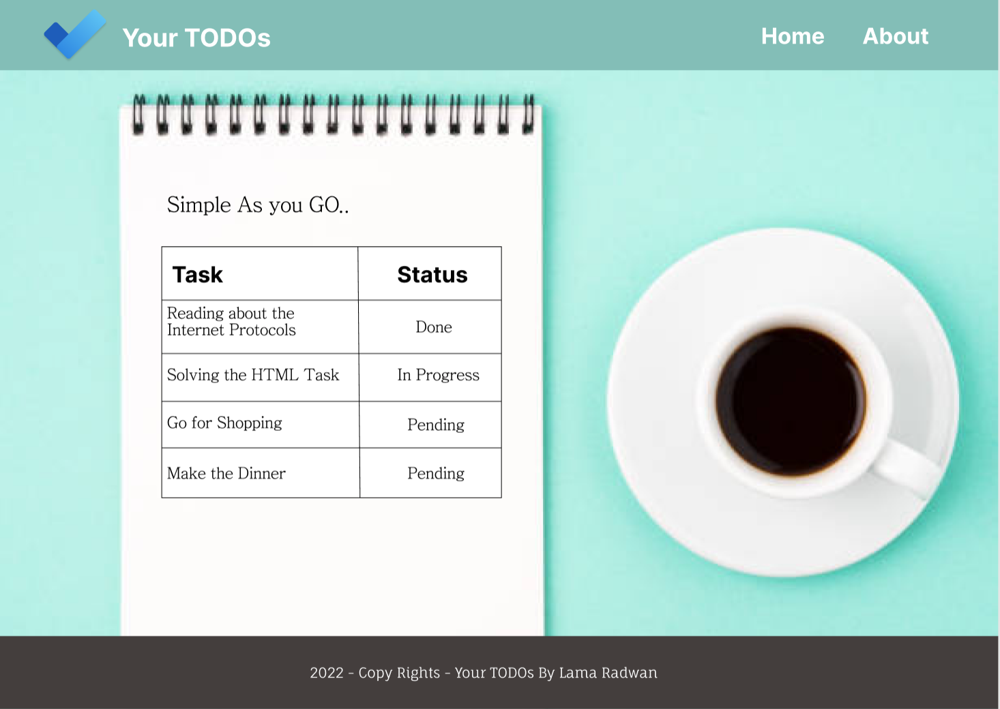
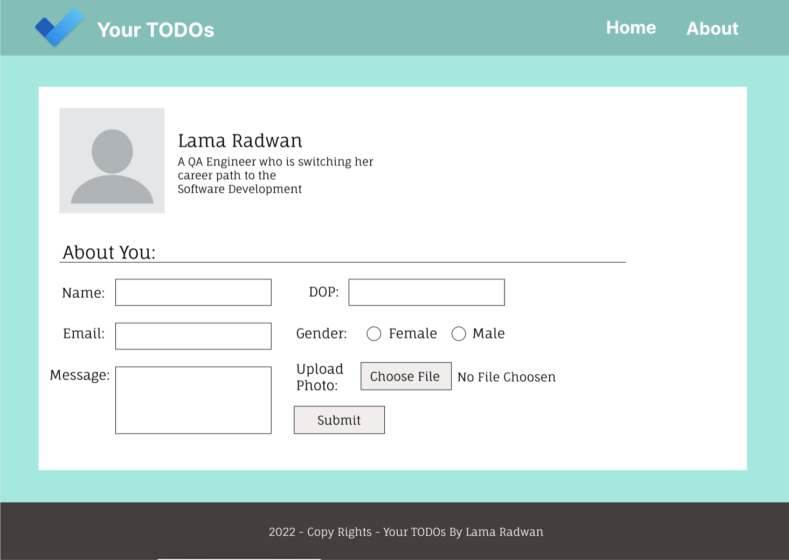

# todo-project

## Your TODOs application
**Note:** This wireframe contains some CSS styling, But I'll not implement it in the current HTML task, these will be implemented in the Later CSS task

[Your TODOs Wireframe Link](https://www.figma.com/file/JyT1W7u3BQnfbEacHAHDRI/Your-TODOs?node-id=0%3A1)

1. Home Page

2. About Page

* What observations or questions do you have about what you’ve learned so far?
I have learned a lot in the first few days, the teaching team is really doing great

* How long did it take you to complete this assignment? And, before you started, how long did you think it would take you to complete this assignment?
I thought it will take 3 hours and It took me exactly 3 hours
